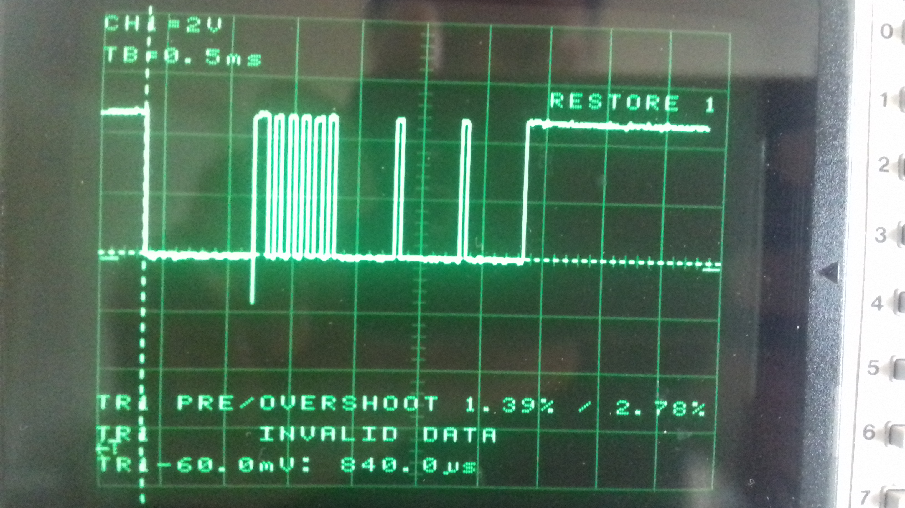

# LIN Synchronization break

In LIN implementation, the 15-bit length Synchronization Break is the major challenge. The Frame Header ideally would contain, besides the Synchronization Break, the Synch byte 0x55 and the PID field. Here we start with a simple frame Header structure consisting of Synch Break, Synch Byte (0x55) and three data fields. 

The current project, consists of the code files: synchbreak.h, synchbreak.cpp and synch_break_direct.ino. It is a part of a whole project where a two-node LIN cluster is implmented using Arduino Mega 2560 and transceiver MCP2003.
 
For keeping our current project short and simple and stayed focused on generating the Header frame at the same time, it's synch_break_direct.ino script has been modified with respect to the original one. The code files can be upload to the Arduino board and run as a freestanding project.  

Fig.1 shows a screenshot for a LIN header frame consisting of 15-bit length Synchronization Break including its delimeter, Synchronization Byte 0x55 and three data bytes of zero value. The Baudrate value is 19200[bits/s], which in turn gives a time bit of Tbit = 1/Baudrate = 52.1 us. The Baudrate setting determines not only how fast the data will be transferred but also the size of the Tbit which ultimately shapes the length of the frame. 

As can be seen from Fig.1, the simple header frame seems to be very accurate. The theoretical value of the 15-bit dominant Synch Byte (15*Tbit = 800 us) is very close to its corresponding value of 840us as shown the screenshot from the scope. So, now we need just to add the PID field and then calculate the Checksum and add it to the end of the frame. The Slave will do the same calculation on the message it receives and compares the calculated Checksum with the one transmitted. If the match, all it’s fine. If they don’t, we should discard it as it’s corrupt.